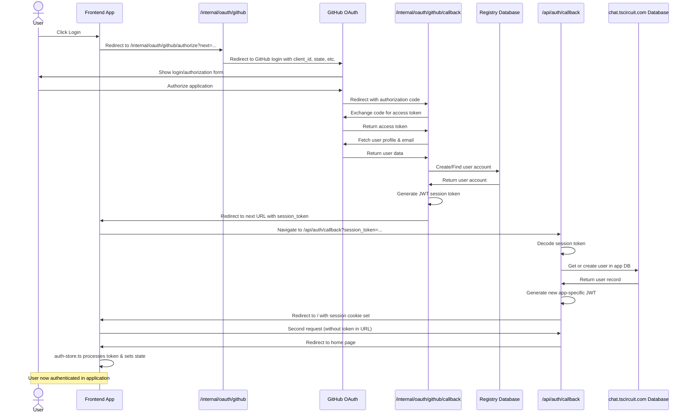

```mermaid
sequenceDiagram
    actor User
    participant Frontend as Frontend App
    participant Internal as /internal/oauth/github
    participant GitHub as GitHub OAuth
    participant InternalCallback as /internal/oauth/github/callback
    participant ExternalDB as Registry Database
    participant AppCallback as /api/auth/callback
    participant AppDB as chat.tscircuit.com Database
    
    User->>Frontend: Click Login
    Frontend->>Internal: Redirect to /internal/oauth/github/authorize?next=...
    
    Internal->>GitHub: Redirect to GitHub login with client_id, state, etc.
    GitHub->>User: Show login/authorization form
    User->>GitHub: Authorize application
    
    GitHub->>InternalCallback: Redirect with authorization code
    InternalCallback->>GitHub: Exchange code for access token
    GitHub->>InternalCallback: Return access token
    
    InternalCallback->>GitHub: Fetch user profile & email
    GitHub->>InternalCallback: Return user data
    
    InternalCallback->>ExternalDB: Create/Find user account
    ExternalDB->>InternalCallback: Return user account
    
    InternalCallback->>InternalCallback: Generate JWT session token
    
    InternalCallback->>Frontend: Redirect to next URL with session_token
    
    Frontend->>AppCallback: Navigate to /api/auth/callback?session_token=...
    
    AppCallback->>AppCallback: Decode session token
    
    AppCallback->>AppDB: Get or create user in app DB
    AppDB->>AppCallback: Return user record
    
    AppCallback->>AppCallback: Generate new app-specific JWT
    
    AppCallback->>Frontend: Redirect to / with session cookie set
    
    Frontend->>AppCallback: Second request (without token in URL)
    AppCallback->>Frontend: Redirect to home page
    
    Frontend->>Frontend: auth-store.ts processes token & sets state
    
    Note over User,Frontend: User now authenticated in application
```
